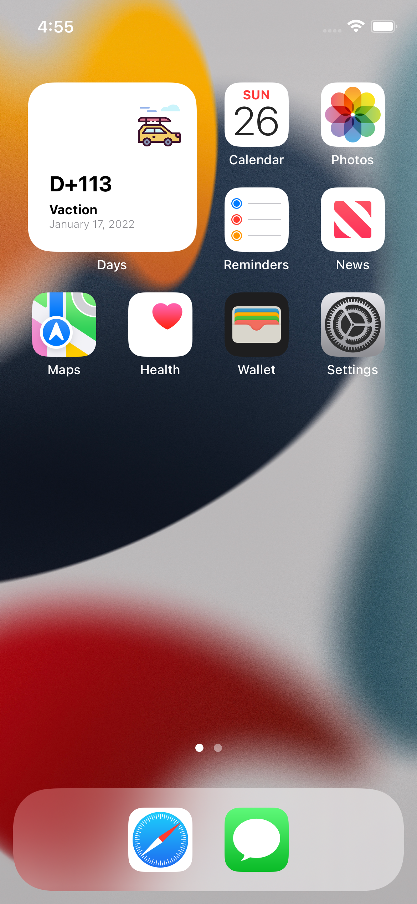
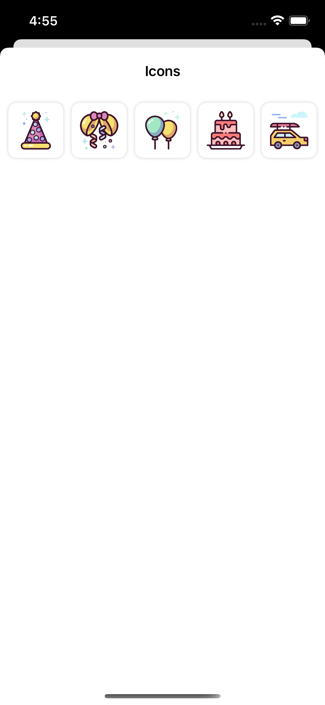

## 📆 Days
D-Day 앱인 The Day Before 의 기본적인 기능을 제작해 보는 앱. 

## 강의 내용
- 프로토콜을 이용하여 데이터 저장소 만들어 보기
- 테스트 코드로 저장소 검증하기
- UITableView 를 이용하여 데이터 연동
- 데이터 추가 및 편집 화면 개발해보기
- SwiftUI 를 이용하여 홈 스크린 위젯 개발해보기

## 최종화면
 
  

## 더 고민해봐야 할 사항
- UserDefaults 가 아닌 SQLite 혹은 CoreData 를 이용하여 어떻게 개발할 수 있을까?

### 링크
[첫화면으로 돌아가기](https://github.com/iwill-hwang/fastcampus-ios)
