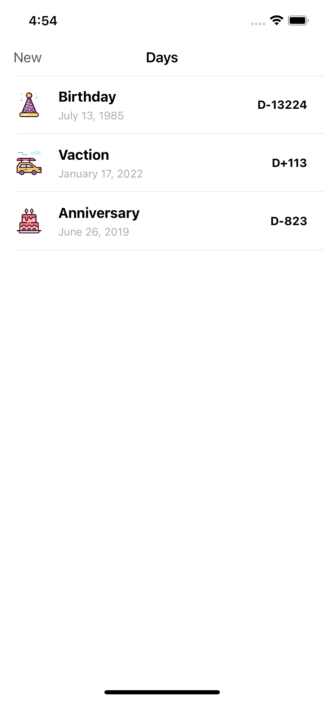
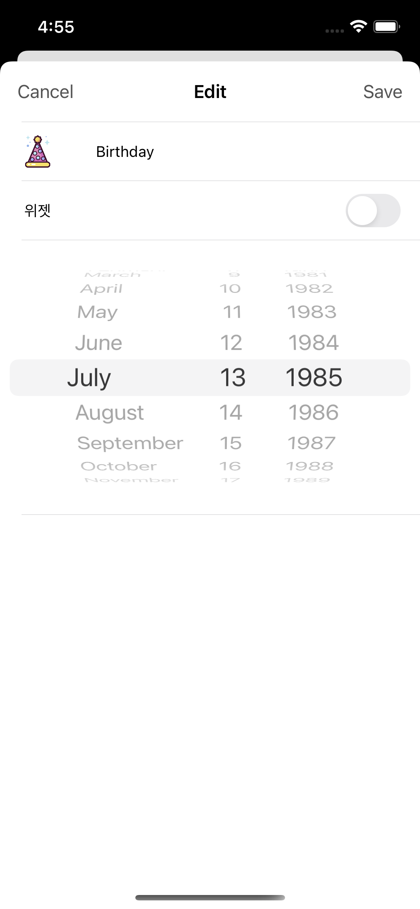

## 🧑‍🎓 Focus
유료앱 상위권에 머물고 있고, 전 세계적으로도 유명한 집중앱 Forest 의 핵심 기능을 클론 앱으로 만들어 본다.
Focus 는 iOS 의 App Life Cycle 을 이용하여 다른 앱으로 이동할 경우의 이벤트를 받아서 집중하기 라는 기능을 만들었다.

## 강의 내용
- 프로토콜을 이용하여 데이터 저장소 만들어 보기
- 테스트 코드로 저장조 검증하기
- UITableView 를 이용하여 데이터 연동
- 데이터 추가 및 편집 화면 개발해보기
- SwiftUI 를 이용하여 홈 스크린 위젯 개발해보기

## 최종화면
   

## 더 고민해봐야 할 사항
- UserDefaults 가 아닌 SQLite 혹은 CoreData 를 이용하여 어떻게 개발할 수 있을까?

### 링크
[첫화면으로 돌아가기](https://github.com/iwill-hwang/fastcampus-ios)
